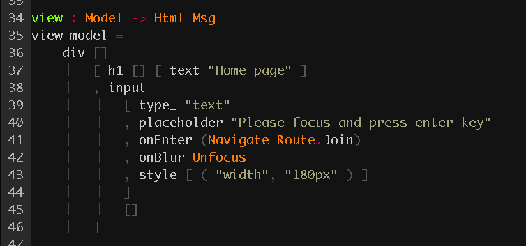
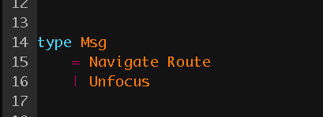

# elm-transition-issue

### I was taught

https://github.com/elm/virtual-dom/issues/103

### Demo

https://pastelinc.github.io/elm-transition-issue/

### What is occurred?

Please press enter key in text field.  This app is crashed!

Why? This app run undefined Msg, if `onBlur`, `onEnter` and transition are triggered at same time.

**input field**

https://github.com/pastelInc/elm-transition-issue/blob/master/Page/Home.elm#L34-L46

This undefined Msg is `JoinUpdate Unfocus`. `Unfocus` Msg is defined `Home.Msg`.
But it is executed as `Join.Msg`.

**home page Msg**

https://github.com/pastelInc/elm-transition-issue/blob/master/Page/Home.elm#L14-L16

**join page Msg**

https://github.com/pastelInc/elm-transition-issue/blob/master/Page/Join.elm#L12-L14

Is this bug?
